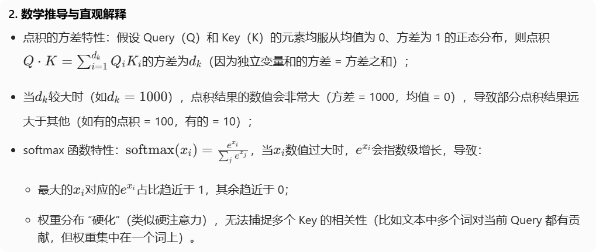

# Task3
> From 无名C
## 心得&笔记&疑问&解答：

- [知识点] 从计算机视觉为起源的神经网络，核心架构三种：
    - FNN全连接：层内节点全连接
    - CNN卷积：中间层节点数比较少→抽象出特征？
    - RNN循环：输出作为输入

- [QA] Q: **三者的区别和架构区别的影响在哪？**
    > A: 
        - **FNN**：层内节点全连接，导致无法区分输入数据的空间/时序关系（如文本中词的顺序、图像中像素的位置），仅能学习全局特征映射，因此仅适用于简单分类（如MNIST手写数字），不适用于结构化数据（文本、图像）。
        - **CNN**：通过**卷积核**捕捉局部模式（如图像的边缘、文本的n-gram短语），再通过**池化**聚合全局信息，核心优势是“空间/局部结构建模”，但**无法处理时序依赖**（如文本中“他”指代前文的“小明”）。
        - **RNN**：循环结构→“时序依赖建模”——通过隐藏状态保存历史信息（如前一个词的语义），核心优势是“序列顺序感知”，但**并行性差、长距离依赖弱**。

- [QA] Q: 这句话怎么理解：“由于NLP任务所需要处理的文本往往是序列，因此专用于处理序列，时序数据的RNN往往能够在NLP任务上取得最优的效果”
    > A: →**顺序matters（“顺序决定语义”）所以是序列，但是RNN处理序列的优势怎么理解和推出来的？**
        >> A: RNN通过循环结构将历史信息编码进隐藏状态；每个时刻的输出依赖于“当前输入+所有历史输入的累积”,相当于浓缩的上下文。

- [知识点] RNN缺点：
    - RNN计算成本高
    - 序列相关的关系只能通过参数来调整，远距离关系易被忽视。

- [QA] Q: **门机制可以做哪些优化？**
    > A: 
    1. **遗忘门（Forget Gate）**：
    - 功能：决定上一时刻隐藏状态 \( h_{t-1} \) 中哪些信息被保留（如文本中“小明”的指代信息）、哪些被遗忘（无关冗余词）。
    - 优化点：避免远距离信息被“梯度消失”冲刷，强化长距离依赖。
    2. **输入门（Input Gate）**：
    - 功能：决定当前时刻输入 \( x_t \) 中哪些信息被纳入隐藏状态（如关键实体、逻辑词）。
    - 优化点：过滤噪声，聚焦核心信息，减少无效参数调整。
    3. **输出门（Output Gate）**：
    - 功能：决定隐藏状态中哪些信息输出到下一时刻（如当前词的语义是否需要传递给下一个词）。
    - 优化点：动态控制信息传递，避免无关信息干扰后续计算。
    4. **GRU的简化优化**：将遗忘门和输入门合并为“更新门”，保留“重置门”，在减少参数的同时保持长依赖建模能力，降低计算成本。

- [QA] Q: **注意力机制最初在cv领域是怎么被提出来的？又是怎么被迁移到NLP领域的？**
    > A: **模拟人类视觉的“选择性关注”**——人类观察图像时会聚焦关键区域（如人脸的眼睛），而非平等处理所有像素。（2014年《Recurrent Models of Visual Attention》（Mnih et al.），提出“硬注意力”（Hard Attention，直接选择部分区域）和“软注意力”（Soft Attention，对所有区域加权），用于解决图像分类、目标检测中的“信息过载”问题（如高分辨率图像的像素冗余）。）
    迁移的转折点：2017年Transformer论文《Attention Is All You Need》，首次将“缩放点积注意力”引入NLP，彻底替代RNN作为核心架构。
    CV中是“图像区域的关联”，NLP中是“token的关联”，本质都是“对结构化数据的选择性信息聚合”。

- [QA] Q：**注意力机制在CV领域是不是可以抽象理解**为画面中一个框？如果是，这个框和注意力机制的三个核心变量（Query、Key、Value）之间的关系是？
    > A: 可以这么理解，但不是一个严格的框。更准确的表述是热点图，**对图像中每个位置的“关注权重分布”**（软注意力）——权重高的区域相当于“框选的核心区域”，权重低的区域相当于“框外的次要区域”。
    与Q/K/V的对应关系
        - **Query（查询）**：当前任务目标（如“检测图像中的猫”“提取图像的边缘特征”），对应“关注框的选择标准”（比如“寻找猫的轮廓特征”）。
        - **Key（键）**：图像中每个区域的特征表示（如像素的纹理、局部卷积特征），对应“关注框的候选区域属性”（比如“某个区域是否有猫的耳朵特征”）。
        - **Value（值）**：图像中每个区域的原始/加工后特征（如像素值、高维卷积特征），对应“关注框内的实际信息内容”（比如“猫耳朵区域的具体像素数据”）。

- [QA] Q：类比NLP中呢？
    > A: 从某个词（query）出发对文本（Key/Value）的每一个token的相对注意分布；Query和Key的相关性

- [QA] 什么叫：通过计算Query与Key的相关性“为真值加权求和”
    > A: “真值”指Value（需要被聚合的原始信息，如NLP中的token向量、CV中的区域特征）；“加权求和”是根据Query与Key的相关性，给每个Value分配不同权重，再累加得到最终的注意力输出。
    #### 示例（NLP场景）
    假设文本是“小明喜欢吃苹果，他每天都买”，当前Query是“他”（想知道“他”指代谁）：
    1. Key是所有token的特征（“小明”“喜欢”“吃”“苹果”“他”“每天”“买”）；
    2. 计算Query（“他”）与每个Key的相关性：“小明”的相关性最高（权重0.8），其他token权重极低（如“喜欢”0.05、“苹果”0.03）；
    3. **Value是所有token的原始词向量；**
    4. 加权求和：0.8ד小明”的向量 + 0.05ד喜欢”的向量 + ... + 0.03ד苹果”的向量 → 最终输出聚焦于“小明”的特征向量，即“他”的注意力结果指向“小明”。

- [QA] 如何针对query，赋予每一个key权重？（对于每个query，每个key的权重都不同吗？）
    > A: 都不同。

- [知识点] 词向量：词义相近的词在向量空间中距离更近；距离：欧氏距离or**向量点积**

- [QA] Q: 点积的几何意义？相似大于0，不相似小于0？）
    > A: 
    点积的公式为：
    $$a \cdot b = |a||b|\cos\theta$$
    其中 \( \theta \) 是两向量的夹角，其本质是：
    > “一个向量在另一个向量方向上的投影长度，乘以另一个向量的模长”
    ### 点积与向量方向的关系
    - 当两向量方向一致，点积达到最大值；
    - 当两向量垂直，点积为0；
    - 当两向量方向相反，点积达到最小值。
    ### 相似性判断
    点积的正负**不直接等同于“相似/不相似”**，而是反映“向量方向是否一致”：
    - 点积>0：两向量夹角<90°，方向大致相同（语义倾向一致，如“猫”和“狗”都是动物）；
    - 点积=0：两向量垂直，无直接关联（如“猫”和“桌子”）；
    - 点积<0：两向量夹角>90°，方向相反（语义倾向相反，如“喜欢”和“讨厌”）。
    ⚠️ 注意：
    相似性需结合向量模长判断——**将向量归一化后（\( |a|=|b|=1 \)）**，点积直接等于 \( \cos\theta \)（取值范围[-1,1]），此时“点积越大，向量的相似性越高”。

- [QA] Q：为什么最终的注意力计算要乘以V？
    > A: 
    1. Query和Key的作用：仅用于计算“哪些信息重要”（权重），但它们本身不包含“需要输出的具体内容”；
    2. Value的作用：存储每个位置的原始/加工后特征（如NLP中的词语义、CV中的图像区域细节），是“权重作用的对象”；
    3. 乘法的意义：将“重要性权重”与“实际信息”绑定——高权重的Value（重要信息）在输出中占比更高，低权重的Value（次要信息）占比更低，最终输出是“筛选后的有效信息聚合”;
    4. 反例（如果不乘V）
    > 若仅用Query与Key的权重输出，相当于“只知道哪些信息重要，但没提取这些信息的内容”，无法形成有意义的特征表示（比如只知道“小明”与“他”相关，但没得到“小明”的语义向量，就无法完成指代消解任务）。
- [QA] Q：怎么理解“如果Q和K对应的维度dk比较大，softmax放缩时非常容易受影响”
    > A: 
   
- [知识点] 例如在 Transformer 的 Decoder 结构中，Q 来自于 Decoder 的输入，K 与 V 来自于 Encoder 的输出，从而拟合了编码信息与历史信息之间的关系，便于综合这两种信息实现未来的预测。

- [QA] Q：Decoder/Encoder是怎么提出来的？提出的初衷是什么？
    > A: 
    - 2014 年《Sequence to Sequence Learning with Neural Networks》（Sutskever et al.）首次提出 “Encoder-Decoder 架构”，将任务拆分为 “理解输入” 和 “生成输出” 两个独立但联动的阶段；
    - 提出的核心初衷，是为了解决 **“序列到序列（Seq2Seq）” 任务 ** 的核心矛盾 ——“输入序列的理解” 与 “输出序列的生成” 需要不同的建模逻辑：
        - Encoder 的初衷：专注于 “理解输入序列的全局语义”（如机器翻译中 “源语言句子的含义”），无需考虑输出端的生成顺序。因此 Encoder 是 “双向建模”（可看到所有输入 token），核心目标是将输入序列编码为一个结构化的 “语义向量”（或特征矩阵）；
        - Decoder 的初衷：专注于 “基于输入语义生成符合规则的输出序列”（如机器翻译中 “目标语言句子”），需要考虑输出的时序依赖（如生成第 t 个词时，只能依赖前 t-1 个词）。因此 Decoder 是 “单向建模”（通过掩码遮蔽未来 token），核心目标是从 Encoder 的语义输出中逐步生成目标序列。
    - 典型场景举例
        - 机器翻译：Encoder 处理 “中文输入”（如 “我喜欢学习”），Decoder 生成 “英文输出”（如 “I like studying”）；
        - 文本摘要：Encoder 理解 “长文本原文”，Decoder 生成 “短文本摘要”；
        - 对话生成：Encoder 理解 “用户问句”，Decoder 生成 “机器人回复”。

- [知识点] 自注意力（self-attention，自注意力）机制。所谓自注意力，即是计算本身序列中每个元素对其他元素的注意力分布，即在计算过程中，Q、K、V 都由同一个输入通过不同的参数矩阵计算得到。在 Encoder 中，Q、K、V 分别是输入对参数矩阵 $W_q、W_k、W_v$ 做积得到，从而拟合输入语句中每一个 token 对其他所有 token 的关系。

- [知识点] 掩码自注意力，即 Mask Self-Attention，是指使用注意力掩码的自注意力机制。掩码的作用是遮蔽一些特定位置的 token，模型在学习的过程中，会忽略掉被遮蔽的 token。

- [知识点] Transformer的机制是即对一个文本序列，不断根据之前的 token 来预测下一个 token，直到将整个文本序列补全。
​
- [QA] Q：掩码自注意力是学习过程中才用到的吗？
    > A: 不是，训练和推理阶段都需要用到，但作用场景和掩码逻辑有差异。训练时强调单向，推理时基于已生成词预测下一个词。

- [QA] Q：RNN为什么可以并行计算？
    > A: 标准RNN因为时序依赖是无法并行计算的。是Transformer的掩码自注意力实现序列计算的并行化。

- [QA] Q：意思是不是一句话拆成5句去输入？
    > A: 是的，多个独立的序列（如批次中的不同句子）可以同时处理，但单个序列内部的时刻计算仍需串行。目的是提升训练速度。
        > 针对这个问题，Transformer 就提出了掩码自注意力的方法。掩码自注意力会生成一串掩码，来遮蔽未来信息。例如，我们待学习的文本序列仍然是 【BOS】I like you【EOS】，我们使用的注意力掩码是【MASK】，那么模型的输入为：

            <BOS> 【MASK】【MASK】【MASK】【MASK】
            <BOS>    I   【MASK】 【MASK】【MASK】
            <BOS>    I     like  【MASK】【MASK】
            <BOS>    I     like    you  【MASK】
            <BOS>    I     like    you   </EOS>

        > 在每一行输入中，模型仍然是只看到前面的 token，预测下一个 token。但是注意，上述输入不再是串行的过程，而可以一起并行地输入到模型中，模型只需要每一个样本根据未被遮蔽的 token 来预测下一个 token 即可，从而实现了并行的语言模型。

- [知识点] 在注意力计算时，我们会将计算得到的注意力分数与这个掩码做和，再进行 Softmax 操作。
- [QA] Q：这个操作的实际意义/影响是什么？
    > A: 通过做求和，上三角区域（也就是应该被遮蔽的 token 对应的位置）的注意力分数结果都变成了 -inf，而下三角区域的分数不变。再做 Softmax 操作，-inf 的值在经过 Softmax 之后会被置为 0，从而忽略了上三角区域计算的注意力分数，从而实现了注意力遮蔽。

- [知识点] 但一次注意力计算只能拟合一种相关关系，单一的注意力机制很难全面拟合语句序列里的相关关系。
- [QA] Q：是不是通过不同的初始化值去拟合不同的相关关系？那会不会出现多次计算最终拟合到了同一种关系？
    > A: 是。初始化时通常使用 “随机正交初始化”，确保不同头的初始投影矩阵差异较大；其他手段：如“参数冗余设置隐性惩罚”。

# Task4
## 心得&笔记&疑问&解答：

- [知识点] 事实上，Seq2Seq 是 NLP 最经典的任务，几乎所有的 NLP 任务都可以视为 Seq2Seq 任务。

- [知识点] 接下来，我们将首先介绍 Encoder 和 Decoder 内部传统神经网络的经典结构——前馈神经网络（FNN）、层归一化（Layer Norm）和残差连接（Residual Connection），然后进一步分析 Encoder 和 Decoder 的内部结构。
- [QA] Q：以上是怎么一个连接顺序？
    > A: 输入 → 【多头自注意力层】→ 【残差连接】→ 【层归一化】→ 【前馈神经网络（FNN）】→ 【残差连接】→ 【层归一化】→ 输出（传入下一个 Encoder 层）

- [知识点] 注意，Transformer 的前馈神经网络是由两个线性层中间加一个 RELU 激活函数组成的，以及前馈神经网络还加入了一个 Dropout 层来防止过拟合。
- [QA] Q：解读一下这么设置的原因。
    > A: 
    两层线性层：实现 “特征升维→特征降维” 的非线性映射；先升维捕捉复杂语义信息；再降维匹配输入维度，同时将高维空间学到的复杂特征压缩回标准维度；
    加入ReLU激活函数：捕捉文本中的非线性语义关系；通过 “截断负值” 引入非线性；
    加入 Dropout 层：防止过拟合，提升模型泛化能力；

- [知识点] 批归一化 层归一化
> 归一化核心是为了让不同层输入的取值范围或者分布能够比较一致。由于深度神经网络中每一层的输入都是上一层的输出，因此多层传递下，对网络中较高的层，之前的所有神经层的参数变化会导致其输入的分布发生较大的改变。也就是说，随着神经网络参数的更新，各层的输出分布是不相同的，且差异会随着网络深度的增大而增大。但是，需要预测的条件分布始终是相同的，从而也就造成了预测的误差。
- [QA] Q：这段话怎么理解？
    > A: 训练过程中，网络的所有参数都在通过梯度下降更新（比如 W、b 的值一直在变），这会导致每一层的输出数据分布，随着训练迭代不断发生变化（比如第 5 层的输入，在第 100 轮迭代和第 200 轮迭代时，均值、方差可能相差很大）。

- [QA] Q：分布转化为标准正态分布的原理
    > A: 先消除均值偏移，让数据围绕0分布；再除以方差的平方根σ，让数据的方差变为1；

- [知识点] 当显存有限，mini-batch 较小时，Batch Norm 取的样本的均值和方差不能反映全局的统计分布信息，从而导致效果变差；
- [QA] Q：效果变差的原理
    > A: 大数定律：当样本数量足够大时，样本的均值会趋近于总体的均值，而样本的方差会趋近于总体的方差。
    当样本数量不足时，样本的统计量（如均值、方差）会有较大的波动，无法代表总体的分布。这就导致了 Batch Norm 在样本数量不足时，归一化效果较差。

- [知识点] 对于在时间维度展开的 RNN，不同句子的同一分布大概率不同，所以 Batch Norm 的归一化会失去意义；
- [QA] Q：这句话怎么理解？
    > A: Batch Norm会对 “批次中所有样本的第 t 个时间步” 计算均值和方差；比如样本1的第5个token是“小明”（人名），样本2的第5个token是“吃”（动词），样本3的第5个token是“苹果”（名词）；对这些毫无关联的token计算均值和方差进行归一化，完全无法反映单个句子内部的分布规律，反而会破坏token自身的语义关联，导致归一化后的结果没有实际意义。

- [知识点] 在训练时，Batch Norm 需要保存每个 step 的统计信息（均值和方差）。在测试时，由于变长句子的特性，测试集可能出现比训练集更长的句子，所以对于后面位置的 step，是没有训练的统计量使用的
- [QA] Q：这句话又怎么理解？
    > A: 可能出现 “测试句长度> 训练句最大长度” 的情况；超出训练范围时，模型没有保存对应的均值和方差统计量，无法进行有效的 Batch Norm 归一化。

- [QA] Q：样本维度和层维度？
    > A:
    - 样本维度：一批32个句子，每个句子50个 token，每个token是512维向量 → [32, 50, 512]；
    - 层维度：多头注意力层的头维度 d_k=64，线性层 1 输出维度 d_ff=2048；
    - 一个横向一个纵向；

- [QA] Q：【残差连接】什么是模型退化
    > A: 模型退化（Model Degradation）是深度神经网络训练中的核心难题，指“当网络深度不断增加时，模型的训练精度和测试精度不仅没有提升，反而会出现持续下降”的现象。主要原因是深度网络中的“梯度消失/梯度爆炸”。
    - 反向传播时，梯度可以通过残差连接（“残差直连通道”）直接传递到低层网络，避免梯度在多层传递中衰减或爆炸。

# Task5
## 心得&笔记&疑问&解答：

- [知识点] Embedding 层其实是⼀个存储固定⼤⼩的词典的嵌⼊向量查找表。在输⼊神经⽹络之前，我们往往会先让⾃然语⾔输⼊通过分词器tokenizer，分词器的作⽤是把⾃然语⾔输⼊切分成 token 并转化成⼀个固定的 index。

- [QA] Q：词表⼤⼩则往往⾼达数万数⼗万。词表是怎么用的？是怎么构建的？
    > A: 
    - 词表的构建：
    词表是“文本token与数字索引的映射字典”，核心是把人类语言转化为模型能处理的数字，构建步骤如下（从原始文本到最终词表）：
    1. **文本预处理**：
    - 清洗：去除标点、特殊字符、冗余空格，统一大小写（如英文`Transformer`和`transformer`视为同一token）；
    - 分词（Tokenization）：将句子拆分为最小语义单元（token），常用3种方式：
        - 单词级分词（Word-level）：`"我喜欢LLM"`→`["我", "喜欢", "LLM"]`（词表大，易有未登录词OOV）；
        - 子词级分词（Subword-level）：BPE/WordPiece（LLM主流），`"unhappiness"`→`["un", "happy", "ness"]`（平衡词表大小和语义完整性）；
        - 字符级分词（Character-level）：`"喜欢"`→`["喜", "欢"]`（词表小，语义需模型自行学习）。
    2. **统计与筛选**：
    - 统计所有token的出现频率；
    - 筛选：保留高频token（如频率≥5），过滤极低频token（减少词表冗余）；
    - 加入特殊token：`<PAD>`（填充）、`<UNK>`（未登录词）、`<BOS>`（句首）、`<EOS>`（句尾）、`<MASK>`（掩码）。
    3. **建立映射**：
    - 给每个筛选后的token分配唯一数字索引（如`<PAD>`→0、`我`→1、`喜欢`→2、`<UNK>`→3）；
    - 最终词表：key是token，value是索引（如`{"<PAD>":0, "我":1, "喜欢":2, ...}`），规模通常为数万（如32k、50k）到数十万（如100k）。
    - 词表的使用逻辑（模型训练/推理时）核心分两步：
    1. **输入阶段**：
    - 句子→token序列：`"我喜欢LLM"`→`["我", "喜欢", "LLM"]`；
    - token→索引序列：通过词表映射为`[1, 2, 456]`（假设`LLM`的索引是456）；
    - 索引→词向量：模型的Embedding层将索引转化为固定维度的词向量（如`[1,2,456]`→`[[1.2,0.8,2.1], [1.5,1.1,2.4], [2.0,1.6,3.0]]`）。
    2. **输出阶段**：
    - 模型输出：预测的索引序列（如`[3, 5, 789]`）；
    - 索引→token：通过词表反向映射为`["他", "热爱", "AI"]`；
    - token→句子：拼接为最终文本`"他热爱AI"`。

- [知识点] 注意⼒机制可以实现良好的并⾏计算，计算⽅式也导致序列中相对位置的丢失。输⼊序列的顺序提供了极其重要的信息。

- [知识点] Transformer 采用了位置编码机制，该机制也在之后被多种模型沿用。
    ​位置编码，即根据序列中 token 的相对位置对其进行编码，再将位置编码加入词向量编码中。位置编码的方式有很多，Transformer 使用了正余弦函数来进行位置编码（绝对位置编码Sinusoidal），其编码方式为：
    $$
    PE(pos, 2i) = sin(pos/10000^{2i/d_{model}})\\
    PE(pos, 2i+1) = cos(pos/10000^{2i/d_{model}})
    $$
    ​上式中，pos 为 token 在句子中的位置，2i 和 2i+1 则是指示了token 是奇数位置还是偶数位置，从上式中我们可以看出对于奇数位置的 token 和偶数位置的 token，Transformer 采用了不同的函数进行编码。

- [知识点] 这样的位置编码主要有两个好处：
    1. 使 PE 能够适应比训练集里面所有句子更长的句子，假设训练集里面最长的句子是有 20 个单词，突然来了一个长度为 21 的句子，则使用公式计算的方法可以计算出第 21 位的 Embedding。
    - [QA] 怎么理解？ 
    2. 可以让模型容易地计算出相对位置，对于固定长度的间距 k，PE(pos+k) 可以用 PE(pos) 计算得到。因为 Sin(A+B) = Sin(A)Cos(B) + Cos(A)Sin(B), Cos(A+B) = Cos(A)Cos(B) - Sin(A)Sin(B)。

- [QA] Q：位置编码原理?
    > A: 
    - 奇偶维度拆分：词向量的**偶数维度（2i）用正弦函数**，**奇数维度（2i+1）用余弦函数**——这样每个位置`pos`都会对应一个唯一的“位置向量”，且位置越近，向量越相似；位置越远，向量差异越大。
    - 举例：
    正余弦位置编码：给同学贴 “周期性标签”
        - 正余弦位置编码的核心思路是：给每个位置（排队顺序）分配一个 “唯一的周期性标签”，标签的规律由正弦和余弦函数决定—— 就像给第 1 位同学贴 “红 - 蓝 - 红”，第 2 位贴 “粉 - 绿 - 粉”，第 3 位贴 “黄 - 紫 - 黄”，标签的颜色变化有固定规律，班主任一看就知道位置。
    **具体操作（对应公式逻辑）**：
        - 标签的 “维度”：标签有多个颜色块（对应词向量的d_model维度，比如d_model=3，每个标签有 3 个颜色块）；
        - 奇偶颜色块分开设计（对应公式中2i偶数维度用正弦、2i+1奇数维度用余弦）：
        - 所有同学的 “偶数位置颜色块”（比如第 1、3 个颜色块），按 “正弦规律” 变色：位置越靠后，颜色变化越慢（比如第 1 位是红色，第 2 位是粉色，第 10 位是浅粉色，第 100 位几乎和第 99 位颜色一样）；
        - 所有同学的 “奇数位置颜色块”（比如第 2 个颜色块），按 “余弦规律” 变色：和正弦颜色块同步，但相位不同（比如第 1 位是蓝色，第 2 位是绿色，第 10 位是浅紫色）；
        - 标签的唯一性：每个位置的 “正弦 + 余弦颜色组合” 是唯一的 —— 比如第 1 位 “红 - 蓝 - 红”，第 2 位 “粉 - 绿 - 粉”，第 3 位 “黄 - 紫 - 黄”，不会重复；
        - 标签的融合：把 “位置标签”（PE）贴在同学的 “身份牌”（词向量 Embedding）上，班主任看到的是 “身份牌 + 标签” 的组合（对应词向量+位置编码），既知道同学是谁（语义），又知道他在哪个位置（顺序）。

- [知识点] 数据证明的理解[**TODO**找个时间完成这部分理解]

- [知识点] 完整的Transformer结构
    

- [知识点] 注意力机制及多头注意力的代码实现：
    > [代码实现](./code/happy-llm.ipynb)
